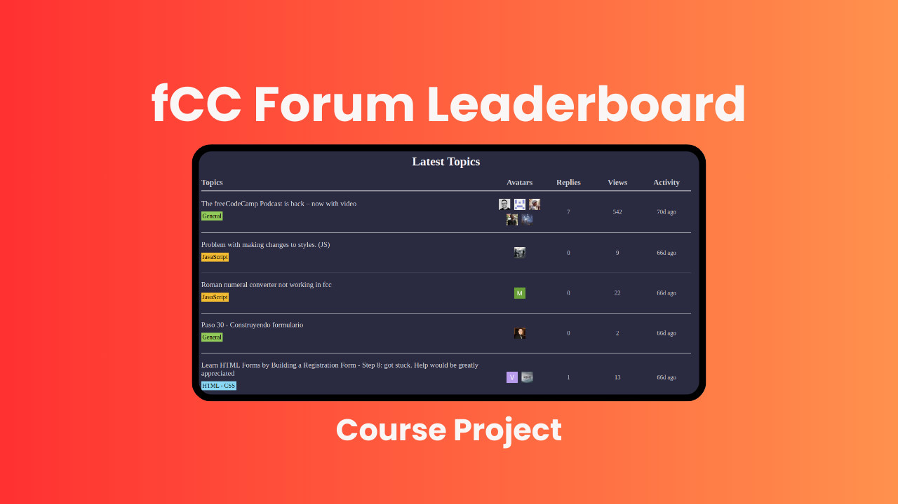
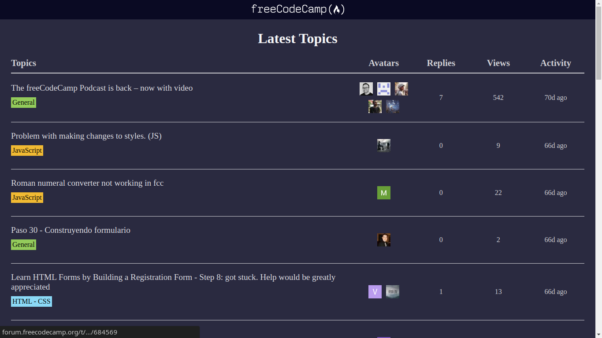

# freeCodeCamp Forum Leaderboard

[-red)](https://www.freecodecamp.org/learn/javascript-algorithms-and-data-structures-v8/)

A course project, where I made a freeCodeCamp Forum Leaderboard with JavaScript (HTML and CSS was already provided). Feel free to check the <a href="https://fcc-forum-leadearboard.vercel.app" target="_blank">website</a> out, and give feedback on what I can improve if you like.

## Technologies:
1. HTML
2. CSS
3. JavaScript

## Project Motive:
This is a course project for <a href="https://www.freecodecamp.org/learn/javascript-algorithms-and-data-structures-v8/" target="_blank">freeCodeCamp JavaScript Algorithms and Data Structures (Beta) Course</a>.

## Contributions:
If you really like the freeCodeCamp Forum Leaderboard, and you see something you can improve, feel free to **fork** this repo, make your changes, and submit a pull request. If you see any spelling mistake on this markdown file, or on the website, please make an **issue**, so that I can fix it. Thanks. Recommendations on how I can improve it would be great.

## What I learnt from making this project:
1. JavaScript
2. Asynchronous Programming

## License:
This project is under the MIT license. Feel free to do whatever you want with it, I really don't care.

## Conclusion:
If you are someone that are looking to hire a developer, whether it is freelancing work, an internship, or a full time position, feel free to reach out to me with one of the following channels: 

  
  
  &nbsp;&nbsp;&nbsp;

